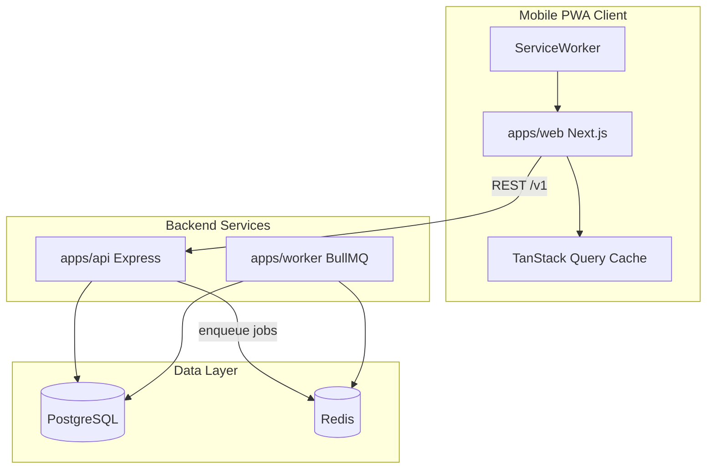
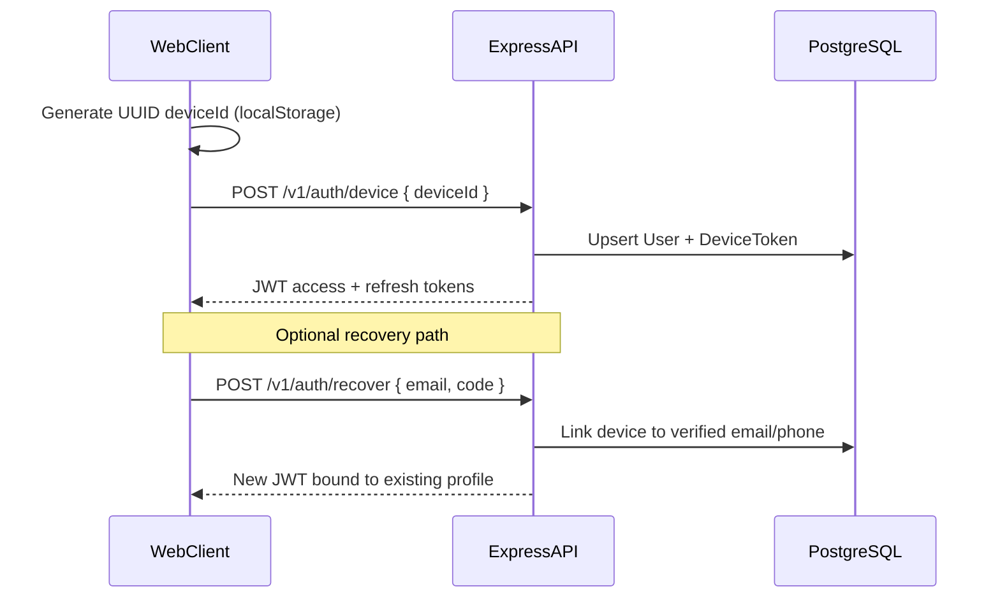

# FitFlow Architecture Plan

Single source of truth for system architecture, module boundaries, authentication, and internationalization.

## System Overview

FitFlow is a fitness management platform where coaches manage workouts and clients, and clients discover, book, and attend workouts. The system is optimized for mobile-first UX, PWA capabilities, and bilingual support (English / Ukrainian).



## Monorepo Structure

| Package | Responsibility |
|---------|----------------|
| `apps/web` | Next.js 15 App Router PWA — client UI, i18n, TanStack Query |
| `apps/api` | Express REST API — auth, workouts, bookings, notifications |
| `apps/worker` | BullMQ consumers — recurrence expansion, push/in-app notifications |
| `packages/shared` | Shared Zod schemas, TypeScript types, constants |

All packages use **pnpm workspaces**. Shared validation schemas live in `packages/shared` and are imported by both API middleware and frontend forms.

## Frontend Architecture (Next.js)

### Routing

- Locale-prefixed routes: `/[locale]/...` where locale is `en` or `uk`
- Feature modules under `src/features/` (auth, bookings, discovery, notifications, workouts)
- Shared UI in `src/components/`, hooks in `src/hooks/`, API client in `src/lib/`

### State Management

- **Server state:** TanStack Query with mobile-friendly defaults (`staleTime: 60s`, `retry: 1`)
- **Client state:** React context for auth session; localStorage for device ID and locale preference
- **Offline:** TanStack Query `persistQueryClient` for workout lists (Milestone 4)

### PWA

- `@ducanh2912/next-pwa` wraps Next.js config
- Service worker disabled in development; active only in production builds
- `public/manifest.json` defines standalone display, theme colors, icons

## Backend Architecture (Express)

### Pattern: Feature-Driven Controller-Service-Repository

Each domain module (`auth`, `workouts`, `bookings`, `notifications`) contains:

- **Controller** — HTTP request/response handling
- **Service** — business logic, orchestration
- **Repository** — Prisma data access

### Middleware Stack

1. `helmet` — security headers
2. `cors` — configured for web app origin
3. `express.json()` — body parsing
4. Route handlers with Zod validation via `validate()` middleware
5. `errorHandler` — last in chain; maps `AppError` and Zod errors to JSON responses

### API Versioning

All endpoints are prefixed with `/v1/`. Example routes:

- `GET /health` — liveness check
- `POST /v1/auth/device` — device-based registration/login
- `POST /v1/auth/refresh` — refresh JWT
- `POST /v1/auth/recover` — email/SMS recovery (Milestone 1)
- `GET /v1/workouts` — list/search workouts
- `POST /v1/bookings` — create booking
- `GET /v1/notifications` — in-app notifications

## Authentication Flow

Device-first authentication enables instant access without mandatory signup. Recovery via email/SMS links the device to an existing profile.



### Token Strategy

| Token | Lifetime | Storage |
|-------|----------|---------|
| Access JWT | 15 minutes | Memory / Authorization header |
| Refresh token | 30 days | httpOnly cookie (web) or secure storage (PWA) |

Access tokens contain: `sub` (userId), `role`, `deviceId`.

### Device ID Generation (Client)

```typescript
// src/lib/device-id.ts
const STORAGE_KEY = 'fitflow_device_id';
// crypto.randomUUID() persisted to localStorage on first visit
```

### Recovery Flow (Future — Milestone 1)

1. Client submits email or phone
2. API sends OTP code via email/SMS provider
3. Client verifies code
4. API links current `deviceId` to the verified user's account
5. New JWT issued with full profile access

## Internationalization (next-intl)

### Locales

| Code | Language | Default |
|------|----------|---------|
| `uk` | Ukrainian | Yes |
| `en` | English | No |

### Locale Detection Priority

1. URL segment: `/uk/...` or `/en/...`
2. Cookie: `NEXT_LOCALE`
3. `Accept-Language` header (via middleware)
4. Fallback: `uk`

### File Structure

```
apps/web/messages/
  en.json
  uk.json
apps/web/src/i18n/
  routing.ts    # locale list, defaultLocale, pathnames
  request.ts    # server-side message loading
```

### Locale Switcher

The `LocaleSwitcher` component writes `NEXT_LOCALE` cookie and navigates to the same pathname under the new locale prefix. All user-facing strings use `useTranslations()` — no hardcoded copy in components.

## Job Queue (BullMQ)

The API enqueues jobs; the worker process consumes them.

| Queue | Purpose |
|-------|---------|
| `recurrence-expand` | Materialize `WorkoutInstance` rows from RRule JSONB (next 90 days) |
| `send-notification` | Deliver in-app and push notifications for booking events |

Job IDs are idempotent: `recurrence:{workoutId}` prevents duplicate expansion jobs.

## Cross-Cutting Concerns

- **Validation:** Zod schemas in `packages/shared`, validated at API boundary
- **Errors:** Typed `AppError` with HTTP status codes; never expose stack traces in production
- **Logging:** Structured console logging in dev; replace with pino/winston in production (Milestone 6)
- **CORS:** `NEXT_PUBLIC_API_URL` origin whitelisted in API config

## Security Notes

- JWT secret must be ≥ 32 characters (enforced in env validation)
- Device IDs are UUIDs — not guessable
- Refresh tokens stored hashed in `RefreshToken` table
- Rate limiting on auth endpoints (Milestone 1)
