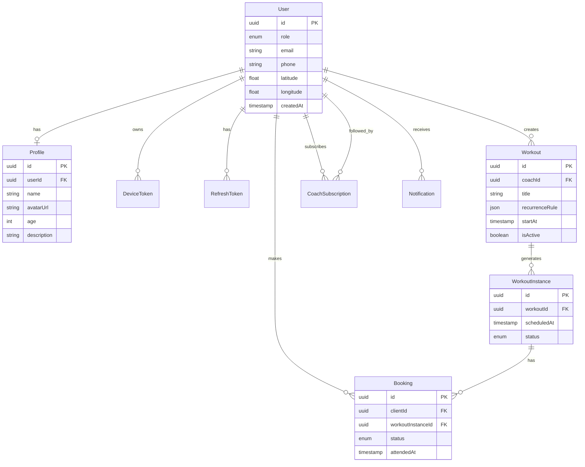

# FitFlow Database Design

PostgreSQL schema design, JSONB recurrence format, and indexing strategy.

## Entity Relationship Overview



## Tables

### User

Core identity for coaches and clients.

| Column | Type | Notes |
|--------|------|-------|
| `id` | UUID | Primary key, auto-generated |
| `role` | `UserRole` enum | `COACH` or `CLIENT` |
| `email` | VARCHAR(255) | Nullable; unique when set |
| `phone` | VARCHAR(20) | Nullable; unique when set |
| `latitude` | FLOAT | Coach location for discovery |
| `longitude` | FLOAT | Coach location for discovery |
| `createdAt` | TIMESTAMPTZ | Default now |
| `updatedAt` | TIMESTAMPTZ | Auto-updated |

### Profile

Extended user information (1:1 with User).

| Column | Type | Notes |
|--------|------|-------|
| `id` | UUID | Primary key |
| `userId` | UUID | FK → User, unique |
| `name` | VARCHAR(100) | Required display name |
| `avatarUrl` | TEXT | Optional |
| `age` | INT | Optional |
| `description` | TEXT | Optional bio |

### DeviceToken

Device-based authentication tokens.

| Column | Type | Notes |
|--------|------|-------|
| `id` | UUID | Primary key |
| `deviceId` | VARCHAR(36) | Unique UUID from client |
| `userId` | UUID | FK → User |
| `userAgent` | TEXT | Optional browser/device info |
| `lastSeenAt` | TIMESTAMPTZ | Updated on each auth |

### Workout

Coach-created workout templates. May be one-off or recurring.

| Column | Type | Notes |
|--------|------|-------|
| `id` | UUID | Primary key |
| `coachId` | UUID | FK → User (role=COACH) |
| `title` | VARCHAR(200) | Workout name |
| `description` | TEXT | Optional details |
| `location` | VARCHAR(300) | Address or venue name |
| `latitude` | FLOAT | Optional geo |
| `longitude` | FLOAT | Optional geo |
| `startAt` | TIMESTAMPTZ | First occurrence anchor |
| `recurrenceRule` | JSONB | Nullable; see below |
| `maxCapacity` | INT | Optional seat limit |
| `isActive` | BOOLEAN | Soft disable |
| `shareCode` | VARCHAR(12) | Unique code for QR/link sharing |

### WorkoutInstance

Materialized workout occurrences (expanded from recurrence or single startAt).

| Column | Type | Notes |
|--------|------|-------|
| `id` | UUID | Primary key |
| `workoutId` | UUID | FK → Workout |
| `scheduledAt` | TIMESTAMPTZ | This occurrence's datetime |
| `status` | `WorkoutInstanceStatus` | SCHEDULED, CANCELED, COMPLETED |

### Booking

Client reservations for specific workout instances.

| Column | Type | Notes |
|--------|------|-------|
| `id` | UUID | Primary key |
| `clientId` | UUID | FK → User (role=CLIENT) |
| `workoutInstanceId` | UUID | FK → WorkoutInstance |
| `status` | `BookingStatus` | PENDING, APPROVED, CANCELED |
| `attendedAt` | TIMESTAMPTZ | Set when marked attended |
| `createdAt` | TIMESTAMPTZ | Booking timestamp |

Unique constraint: `(clientId, workoutInstanceId)` — one booking per client per instance.

### CoachSubscription

Client follows a coach's schedule for discovery/notifications.

| Column | Type | Notes |
|--------|------|-------|
| `id` | UUID | Primary key |
| `clientId` | UUID | FK → User |
| `coachId` | UUID | FK → User |
| `createdAt` | TIMESTAMPTZ | Subscription date |

Unique constraint: `(clientId, coachId)`.

### Notification

In-app notification records.

| Column | Type | Notes |
|--------|------|-------|
| `id` | UUID | Primary key |
| `userId` | UUID | FK → User |
| `type` | `NotificationType` | See enum below |
| `payload` | JSONB | Event-specific data |
| `readAt` | TIMESTAMPTZ | Null until read |
| `createdAt` | TIMESTAMPTZ | Creation time |

### RefreshToken

JWT refresh token rotation.

| Column | Type | Notes |
|--------|------|-------|
| `id` | UUID | Primary key |
| `token` | VARCHAR(64) | Hashed token value |
| `userId` | UUID | FK → User |
| `expiresAt` | TIMESTAMPTZ | Expiration |
| `createdAt` | TIMESTAMPTZ | Issue date |

## Enums

```prisma
enum UserRole { COACH, CLIENT }
enum BookingStatus { PENDING, APPROVED, CANCELED }
enum WorkoutInstanceStatus { SCHEDULED, CANCELED, COMPLETED }
enum NotificationType {
  BOOKING_REQUEST
  BOOKING_APPROVED
  BOOKING_REJECTED
  BOOKING_CANCELED
  SCHEDULE_CHANGED
  WORKOUT_CANCELED
}
```

## JSONB Recurrence Rule

Stored on `Workout.recurrenceRule`. Uses RFC 5545 RRule strings for interoperability.

### Schema

```json
{
  "rrule": "FREQ=WEEKLY;BYDAY=MO,WE,FR;INTERVAL=1",
  "dtstart": "2026-06-19T09:00:00.000Z",
  "timezone": "Europe/Kyiv",
  "durationMinutes": 60,
  "exceptions": ["2026-07-01T09:00:00.000Z"],
  "endDate": "2026-12-31T23:59:59.000Z"
}
```

| Field | Type | Required | Description |
|-------|------|----------|-------------|
| `rrule` | string | Yes | RFC 5545 RRULE (without `DTSTART` prefix) |
| `dtstart` | ISO 8601 | Yes | Anchor datetime for rule expansion |
| `timezone` | IANA string | Yes | e.g. `Europe/Kyiv` — applied during expansion |
| `durationMinutes` | number | Yes | Session length |
| `exceptions` | ISO 8601[] | No | Cancelled/skipped occurrence datetimes |
| `endDate` | ISO 8601 | No | Stop expanding after this date |

### One-Off Workouts

When `recurrenceRule` is `null`, the workout is a single occurrence. A `WorkoutInstance` is created directly from `startAt`.

### Expansion Strategy (Worker)

1. BullMQ job `recurrence-expand` triggered on workout create/update
2. Worker loads `recurrenceRule` JSONB
3. Uses `rrule` npm package: `RRule.fromString(rule.rrule)` with `dtstart` and `timezone`
4. Generates occurrences for next **90 days**
5. Upserts `WorkoutInstance` rows (idempotent on `workoutId + scheduledAt`)
6. Skips datetimes in `exceptions` array
7. Nightly repeatable job re-expands rolling window

### Example RRule Patterns

| Pattern | RRULE |
|---------|-------|
| Every Monday | `FREQ=WEEKLY;BYDAY=MO;INTERVAL=1` |
| Mon/Wed/Fri | `FREQ=WEEKLY;BYDAY=MO,WE,FR;INTERVAL=1` |
| Bi-weekly Tuesday | `FREQ=WEEKLY;BYDAY=TU;INTERVAL=2` |
| Daily | `FREQ=DAILY;INTERVAL=1` |

## Indexing Strategy

### Coach Discovery (Location)

```sql
-- Composite index for role-filtered geo queries
CREATE INDEX idx_user_role_location ON "User" (role, latitude, longitude)
  WHERE latitude IS NOT NULL AND longitude IS NOT NULL;
```

MVP uses bounding-box filter in application code:

```typescript
// Find coaches within ~10km bounding box
WHERE role = 'COACH'
  AND latitude BETWEEN lat - 0.09 AND lat + 0.09
  AND longitude BETWEEN lng - 0.12 AND lng + 0.12
```

Post-MVP: PostGIS `ST_DWithin` for accurate radius search.

### Workout Date Queries

```sql
CREATE INDEX idx_workout_coach_start ON "Workout" (coach_id, start_at);
CREATE INDEX idx_workout_instance_scheduled ON "WorkoutInstance" (workout_id, scheduled_at);
CREATE INDEX idx_workout_instance_date ON "WorkoutInstance" (scheduled_at);
```

### Booking Queries

```sql
CREATE INDEX idx_booking_client_status ON "Booking" (client_id, status, created_at DESC);
CREATE UNIQUE INDEX idx_booking_client_instance ON "Booking" (client_id, workout_instance_id);
```

### Auth Lookups

```sql
CREATE UNIQUE INDEX idx_device_token_device_id ON "DeviceToken" (device_id);
CREATE INDEX idx_refresh_token_user ON "RefreshToken" (user_id, expires_at);
```

### Share Code / Discovery

```sql
CREATE UNIQUE INDEX idx_workout_share_code ON "Workout" (share_code) WHERE share_code IS NOT NULL;
```

### JSONB (Deferred)

GIN index on `Workout.recurrenceRule` only needed if querying inside JSONB fields. Not required for MVP since expansion happens in worker.

## Migration Strategy

- Use Prisma Migrate for all schema changes
- `pnpm db:push` for local dev rapid iteration
- `pnpm db:migrate` for versioned migrations in CI/staging/prod
- Seed script (`prisma/seed.ts`) creates sample coach + client + workout for dev
